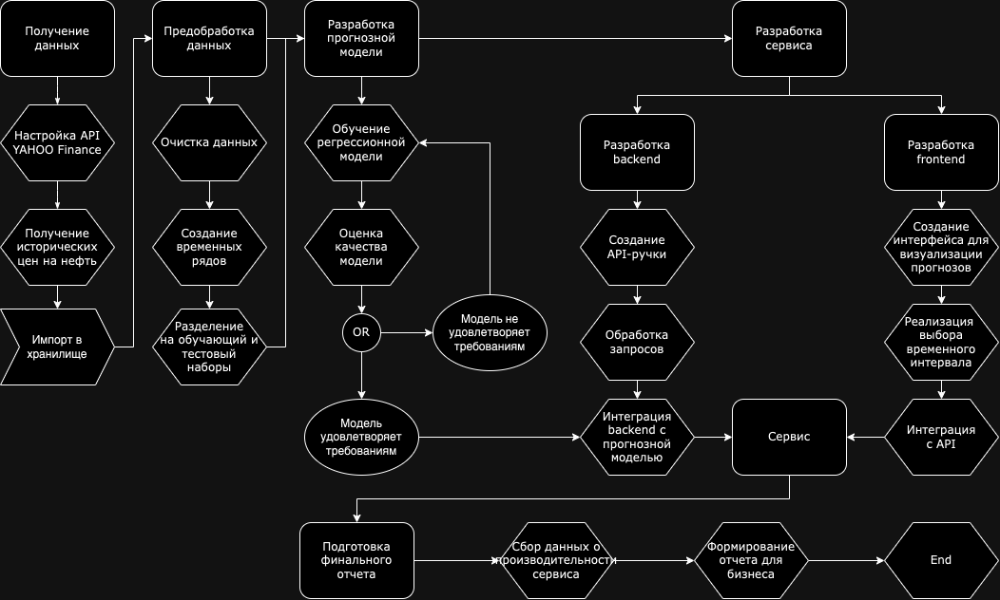

# Дизайндок MVP <MLSystemDesign>

## 1. Цели и предпосылки

### 1.1 Зачем идем в разработку продукта?

- **Бизнес-цель:** Снижение издержек на составление рекомендаций вручную о том, когда следует покупать нефть на бирже.

- **Преимущества использования ML:** В настоящее время нет доступных высококачественных решений для этой задачи. Применение ML позволит создать такое решение, улучшив тем самым текущее положение вещей.

- **Критерии успеха бизнеса:** Итерация будет считаться успешной, если прогноз цены на нефть на следующий день будет иметь отклонение менее 4 рублей.

### 1.2 Бизнес-требования и ограничения
#### Основные функции

  1. **Прогнозирование цен на нефть:** Сервис должен предоставлять точные и своевременные прогнозы цен на нефть на различные временные интервалы (день, неделя, месяц).

  2. **Интерфейс для визуализации:** Пользователи должны иметь доступ к удобному интерфейсу для визуализации прогнозов, позволяющего анализировать тренды и изменения цен на нефть.

  3. **Гибкость параметров прогнозирования:** Пользователи должны иметь возможность выбирать различные параметры прогнозирования, такие как временной интервал, горизонт прогноза и др.  

**Бизнес-требования:** 

Необходимы прогнозы цены на нефть на день, неделю и месяц, где отклонение прогноза от фактической цены на следующий день не превышает 4 рубля. Дополнительно, система должна предоставлять интерактивные отчеты с детализацией по временным интервалам, что обеспечит пользователям лучшее понимание долгосрочных тенденций.

**Бизнес-ограничения:** 

Проект должен быть реализован в течение 3 месяцев. Это время включает в себя все этапы, начиная от сбора данных и обучения модели до внедрения и тестирования. Также важно учесть, что бизнес-требования могут подвергнуться изменениям, и система должна быть гибкой для адаптации.

**Ожидания от итерации:** 

В рамках текущей итерации основным фокусом будет разработка модели прогнозирования цены на нефть на следующий день. Предполагается, что модель будет оснащена механизмом обучения на основе новых данных, чтобы поддерживать актуальность прогнозов.

**Описание бизнес-процесса пилота:** 

Модель будет использоваться для генерации визуализаций на web-сайте, предоставляющих информацию о прогнозах цены на нефть. Эти визуализации будут интегрированы в решающий процесс по закупке нефти, что позволит принимать обоснованные решения на основе данных и улучшит эффективность закупочных стратегий. Типичный use case использования сервиса - пользователь заходит на web-сайт, смотрит прогноз цены на нефть на следующий день/неделю и делает из этого вывод, стоит ли делать закупку.

**Критерии успешного пилота:** 

Пилотная версия считается успешной при достижении точности прогноза с отклонением менее 4 рублей на протяжении 1 месяца. Кроме того, успешный пилот должен продемонстрировать удовлетворительную стабильность работы системы при обработке реальных данных. Возможные направления развития включают улучшение точности прогнозов и расширение спектра предсказываемых товаров в будущих этапах проекта.

#### Требования к безопасности

1. **Конфиденциальность данных:** Гарантировать конфиденциальность и защиту данных пользователей, предотвращая несанкционированный доступ.

2. **Защита от мошенничества:** Реализовать механизмы для выявления и предотвращения мошенничества в системе.

#### Интеграция и расширяемость

1. **API для интеграции:** Предоставить API для интеграции с другими системами и приложениями.

2. **Масштабируемость:** Обеспечить возможность горизонтального и вертикального масштабирования для обработки роста пользовательского трафика.

#### Ожидаемые результаты

1. **Увеличение эффективности бизнес-решений:** Пользователи должны иметь возможность принимать более информированные решения на основе точных прогнозов цен на нефть.

2. **Рост использования сервиса:** Ожидается увеличение числа пользователей и активность использования сервиса после его запуска.

### 1.3 Технические требования и ограничения

#### Общие требования

1. **Системные ресурсы:**
    - CPU: Минимум 4 ядра, рекомендуется 8 ядер или более.
    - RAM: Минимум 8 ГБ, рекомендуется 16 ГБ или более.
    - Disk: Минимум 100 ГБ свободного пространства на диске.

2. **Пропускная способность сети:**
    - Минимальная скорость соединения 100 Мбит/с.

#### Требования к высокой нагрузке

1. **Системные ресурсы в случае высокой нагрузки:**
    - CPU: 16 ядер или более.
    - RAM: 32 ГБ или более.
    - Disk: 500 ГБ свободного пространства на диске.

2. **Пропускная способность сети в случае высокой нагрузки:**
    - Минимальная скорость соединения 1 Гбит/с.

#### Требования к железу

1. **CPU:**
    - Предпочтительно использовать процессоры с поддержкой многозадачности и высокой производительностью, такие как Intel Xeon или AMD Ryzen.

2. **RAM:**
    - Использование ECC (Error-Correcting Code) RAM для обеспечения стабильности и надежности работы.

3. **Disk:**
    - Рекомендуется использовать SSD для ускорения операций ввода-вывода и обеспечения быстрого доступа к данным.

#### Оптимизация производительности

1. **Кеширование данных:**
    - Внедрение механизмов кеширования для ускорения ответов на повторяющиеся запросы.

2. **Оптимизация запросов к базе данных:**
    - Использование индексов и оптимизированных запросов для минимизации времени обращения к базе данных.

3. **Масштабируемость:**
    - Разработка с учетом возможности горизонтального масштабирования для обработки растущей нагрузки.

4. **Мониторинг производительности:**
    - Развертывание системы мониторинга производительности для наблюдения за ресурсами системы и своевременного выявления проблем.

#### Обеспечение безопасности

1. **Шифрование данных:**
    - Использование протоколов шифрования данных (например, TLS/SSL) для обеспечения безопасности передачи информации.

2. **Аутентификация и авторизация:**
    - Внедрение механизмов аутентификации и авторизации для контроля доступа к сервису.

3. **Обновление и патчи:**
    - Рекомендуется регулярное обновление операционной системы, серверного программного обеспечения и прикладных компонентов для устранения уязвимостей.

#### Мониторинг и отчетность

1. **Система мониторинга:**
    - Развертывание системы мониторинга, включая инструменты для отслеживания состояния системы, использования ресурсов и производительности.

2. **Алертинг:**
    - Настройка механизмов алертинга для своевременного оповещения о возможных проблемах и событиях. Разработка механизмов быстрого реагирования на аномалии.

3. **Отчеты о производительности:**
    - Регулярная генерация отчетов о производительности для анализа эффективности работы сервиса и выявления узких мест. Включение информации о времени ответа API, количестве запросов, и других метриках производительности.

### 1.4 Что входит в скоуп проекта/итерации, что не входит

**В скоуп итерации входит:**
  - Налаживание процесса получения данных об исторических ценах на нефть с источника YAHOO Finance
  - Разработка модели прогнозирования цен на нефть на следующий день.
  - Разработка backend и frotnend для удобного использования сервиса 

**Результат с точки зрения качества кода и воспроизводимости:**
  - Создание API-эндпоинта, который будет возвращать прогноз цены на следующий день, используя предварительно обученную модель машинного обучения.
  - Создание web-сайта, который обращается к этому API-эндопинту и отображает цены на нефть на графике - исторические и прогнозируемые

**Технический долг:**
  - Основной фокус на прогноз на следующий день с отклонением менее 4 рублей, при этом прогнозы на неделю и на месяц будут разработаны в последующих итерациях.

### 1.5 Предпосылки решения
**Анализ данных:** 

Проведение тщательного анализа имеющихся данных о ценах на нефть, включая временные ряды, статистические показатели и особенности рыночной динамики. Основное внимание уделяется выявлению трендов, сезонных колебаний и других факторов, влияющих на ценообразование.

**Технологический анализ:** 

Оценка текущих технологий в области машинного обучения (ML) и прогнозирования временных рядов. Идентификация наилучших методов для решения поставленной задачи с учетом особенностей предоставленных данных. Оценка возможности использования современных инструментов и библиотек ML.

**Оценка вычислительных ресурсов:** 

Проанализировать требования к вычислительным ресурсам, необходимым для обучения и эксплуатации прогностической модели. Учитывать возможные расходы на оборудование и инфраструктуру для обеспечения эффективного функционирования модели.

**Оценка потенциальных рисков:** 

Выявление и анализ возможных рисков, связанных с созданием и внедрением прогностической модели. Разработка стратегий минимизации рисков и гибкости системы для адаптации к изменениям в данных или бизнес-требованиях.

**Оценка потенциала масштабирования:** 

Исследование возможности масштабирования решения в будущем, включая увеличение объема данных, расширение предсказываемых параметров и поддержку роста функциональности.

## 2. Методология   

### 2.1. Постановка задачи  

**Что делаем с технической точки зрения:** 

Настраиваем процесс получения данных об исторических ценах на нефть с источника YAHOO Finance по API. Решаем задачу регрессии на этих данных, чтобы прогнозировать цену на нефть на следующий день, на неделю и на месяц. Создаем API-ручку на fastapi. Разрабатываем frontend на react.

### 2.2. Блок-схема решения  

### 2.3. Этапы решения задачи  

### Этап 1. Подготовка данных

 
| Название данных            | Требуемый ресурс для получения данных (какие роли нужны) | Проверено ли качество данных (да, нет) |
|----------------------------|----------------------------------------------------------|----------------------------------------|
| Исторические цены на нефть | DS                                                       | Да                                     |
 
Результатом этапа должен стать `pd.DataFrame`, используемый в дальнейшем для обучения и валидации моделей, 
а также для визуализации исторических данных быть функция получения исторических цен на нефть.  

### Этап 2. Предобработка данных  
| Операция                                                         | Baseline | MVP      | Описание                                                                                                                                                                                       |
|------------------------------------------------------------------|----------|----------|------------------------------------------------------------------------------------------------------------------------------------------------------------------------------------------------|
| Очистка данных от выбросов и ошибок                              | Pandas   | Pandas   | Использование методов `clip` для обрезки выбросов и `drop` для удаления некорректных значений в столбцах с ценами на нефть. Применяются границы на основе статистических характеристик данных. |
| Создание временных рядов                                         | Pandas   | Pandas   | Использование метода `set_index` для установки временных меток в качестве индекса `DataFrame`, преобразуя данные в временные ряды.                                                             |
| Разделение данных на обучающую, валидационную и тестовую выборки | Sklearn  | Sklearn  | Использование `TimeSeriesSplit` для учета временной зависимости и обеспечения правильного порядка данных во времени.                                                                           |

### Этап 3. Разработка прогнозных моделей
| Операция                                                       | Baseline                                                                  | MVP                                                                                      | Описание                                                                                            |
|----------------------------------------------------------------|---------------------------------------------------------------------------|------------------------------------------------------------------------------------------|-----------------------------------------------------------------------------------------------------|
| Определение целевой переменной                                 | Цена на нефть на следующий день                                           | Цена на нефть на следующий день, неделю, месяц                                           | Уточнение целевой переменной в соответствии с бизнес-требованиями.                                  |
| Используемые метрики качества                                  | MAE, RMSE                                                                 | MAE, RMSE                                                                                | Расширение списка метрик для оценки качества различных моделей временных рядов.                     |
| Необходимый результат                                          | Обученная SARIMA модель                                                   | Набор обученных моделей сравнительного анализа                                           | Получение не только базовой SARIMA модели, но и других моделей для сравнения и выбора наилучшей.    |
| Feature Engineering                                            | Временной ряд                                                             | Дополнительные экономические, временные признаки                                         | Уточнение списка признаков в соответствии с EDA и включение их в модели.                            |
| Техника кросс-валидации                                        | TimeSeriesSplit                                                           | TimeSeriesSplit                                                                          | Использование TimeSeriesSplit для корректной оценки производительности моделей на временных данных. |
| Используемые модели                                            | SARIMA                                                                    | Prophet, SARIMAX, TBATS и другие                                                         | Рассмотрение различных моделей временных рядов для выбора оптимальной.                              |
| Горизонт, гранулярность, частота пересчета прогнозных моделей  | Прогнозирование на следующий день. Дневные данные. Ежедневный пересчет.   | Прогнозирование на следующий день, неделю, месяц. Дневные данные. Ежедневный пересчет.   | Сохранение горизонта, гранулярности и частоты пересчета моделей для сравнения результатов.          |
                                                                                                  

#### Риски этапа 3. Разработка прогнозных моделей

| Риск                                                               | Baseline                                                                                                              | MVP                                                                                                                  | Описание                                                                                                                         |
|--------------------------------------------------------------------|-----------------------------------------------------------------------------------------------------------------------|----------------------------------------------------------------------------------------------------------------------|----------------------------------------------------------------------------------------------------------------------------------|
| Определение целевой переменной может быть узкоспециализированным   | Недостаточная ясность в бизнес-требованиях может привести к неправильному выбору целевой переменной.                  | Дополнительные целевые переменные могут сделать модель сложнее и требовать больше данных.                            | Риск связан с неоднозначностью в трактовке бизнес-требований и возможностью выбора узкоспециализированной целевой переменной.    |
| Ограниченный набор метрик может не отразить требования бизнеса     | Метрики MAE и RMSE могут быть недостаточными для полного оценивания качества моделей.                                 | Необходимость выбора различных метрик для разных временных интервалов усложняет оценку качества.                     | Ограниченность выбранных метрик может привести к недооценке важных характеристик моделей и неверному восприятию их качества.     |
| Недостаточная четкость в ожидаемых результатах                     | Неопределенность в том, что считается успешным результатом, может привести к недопониманию качества модели.           | Неопределенность в ожидаемых результатах может затруднить оценку эффективности выбранных моделей.                    | Риск связан с нечеткостью в понимании того, что будет считаться успешным результатом на этапе разработки прогнозных моделей.     |
| Неправильный выбор признаков может ухудшить производительность     | Ограничение выбора признаков только временными рядами может не учесть дополнительные факторы, влияющие на цену нефти. | Дополнительные признаки требуют аккуратного отбора, чтобы не ухудшить производительность моделей.                    | Риск связан с необходимостью внимательного выбора дополнительных признаков для предотвращения потери производительности моделей. |
| Неправильная техника кросс-валидации может привести к ошибкам      | Неправильное разбиение временных данных может привести к переоценке производительности моделей.                       | Неправильная техника кросс-валидации может привести к недооценке или переоценке производительности.                  | Риск связан с необходимостью правильного выбора техники кросс-валидации для корректной оценки моделей на временных данных.       |
| Ограничение выбора моделей может привести к упущению оптимального  | Ограничение выбора моделей может исключить более подходящие варианты, не рассмотренные на этапе бейзлайна.            | Различные модели могут проявлять разную эффективность, исключение которых может привести к упущенным возможностям.   | Риск связан с возможным упущением более эффективных моделей из-за ограниченного выбора на этапе бейзлайна.                       |

### Этап 4. Разработка backend

| Операция                                       | Baseline                                                         | MVP                                           | Описание                                                                                                                                                                                                                                  |
|------------------------------------------------|------------------------------------------------------------------|-----------------------------------------------|-------------------------------------------------------------------------------------------------------------------------------------------------------------------------------------------------------------------------------------------|
| Создание API-ручки с использованием FastAPI    | Разработка API для предоставления доступа к прогнозам            | То же, что и в бейзлайне                      | Разработка API-ручки с использованием FastAPI для предоставления доступа к прогнозам. Используем библиотеку FastAPI для создания эффективного, быстрого и надежного интерфейса.                                                           |
| Обработка запросов                             | Поддержка запросов для различных временных интервалов            | То же, что и в бейзлайне                      | Обработка запросов на прогнозирование для различных временных интервалов. В MVP используем те же методы, что и в бейзлайне, с учетом возможного расширения функционала.                                                                   |
| Интеграция бэкенда с прогнозной моделью        | Интеграция API с прогнозной моделью, обеспечение взаимодействия  | То же, что и в бейзлайне                      | Интеграция разработанного бэкенда с прогнозной моделью. Обеспечиваем взаимодействие между API и моделью, используя методы и библиотеки, выбранные в предыдущих этапах, чтобы гарантировать корректное и эффективное выполнение прогнозов. |

#### Риски этапа 4. Разработка backend

| Риск                                                                       | Baseline                                                                                    | MVP                                                                                                | Описание                                                                                                                      |
|----------------------------------------------------------------------------|---------------------------------------------------------------------------------------------|----------------------------------------------------------------------------------------------------|-------------------------------------------------------------------------------------------------------------------------------|
| Задержки в разработке API могут повлиять на другие этапы                   | Недостаточная эффективность библиотеки FastAPI может привести к задержкам в разработке API. |  Расширение функционала API может привести к дополнительным задержкам.                             | Риск связан с возможными задержками в разработке API, что может отразиться на следующих этапах проекта.                       |
| Неполадки в обработке запросов могут привести к неверным прогнозам         | Неправильная обработка запросов может привести к некорректным прогнозам цен на нефть.       |  Расширение функционала запросов может увеличить сложность и привести к ошибкам в обработке.       | Риск связан с возможными неполадками в обработке запросов, что может привести к выдаче неверных прогнозов.                    |
| Проблемы интеграции бэкенда с прогнозной моделью могут затруднить процесс  | Неправильная интеграция API с моделью может привести к ошибкам в прогнозах.                 |  Расширение функционала интеграции может усложнить взаимодействие между API и моделью.             | Риск связан с возможными проблемами в интеграции бэкенда с прогнозной моделью, что может затруднить процесс прогнозирования.  |

### Этап 5. Разработка frontend

| Операция                   | Baseline                                       | MVP                                                                               | Описание                                                                                                                                                                                                                                                       |
|----------------------------|------------------------------------------------|-----------------------------------------------------------------------------------|----------------------------------------------------------------------------------------------------------------------------------------------------------------------------------------------------------------------------------------------------------------|
| Создание интерфейса        | Простой интерфейс для визуализации прогнозов   | Разработка интерфейса с улучшенной визуализацией прогнозов                        | Создание пользовательского интерфейса с использованием React для визуализации прогнозов цен на нефть. Бейзлайн включает в себя простой интерфейс, а в MVP происходит разработка с более сложной визуализацией и улучшенной функциональностью, используя React. |
| Визуализация прогнозов     | Отображение графиков с прогнозами цен на нефть | Расширение визуализации с дополнительными графиками и параметрами                 | Использование библиотек для визуализации данных, таких как Chart.js или D3.js, в React-компонентах для отображения графиков с прогнозами цен на нефть. В MVP добавляются дополнительные графики и параметры для расширения визуализации.                       |
| Выбор временного интервала | Опция выбора временного интервала для прогноза | Улучшение опции выбора интервала и добавление дополнительных временных параметров | Использование React-компонентов для создания опции выбора временного интервала. Улучшение функционала в MVP, добавление дополнительных параметров и возможностей для выбора времени.                                                                           |
| Интеграция с API           | Взаимодействие с API для получения прогнозов   | Интеграция с API для динамического обновления данных                              | Реализация интеграции с API для получения динамических прогнозов. Использование средств React, таких как Axios, для выполнения запросов к API и обновления данных на фронтенде.                                                                                |

#### Риски этапа 5. Разработка frontend

| Риск                                                                   | Бейзлайн                                                                                                  | MVP                                                                                               | Описание                                                                                                                            |
|------------------------------------------------------------------------|-----------------------------------------------------------------------------------------------------------|---------------------------------------------------------------------------------------------------|-------------------------------------------------------------------------------------------------------------------------------------|
| Задержки в создании базового интерфейса могут повлиять на весь процесс |  Задержки в создании базового интерфейса могут затруднить визуализацию прогнозов.                         | Усложнение интерфейса в MVP может привести к дополнительным задержкам.                            | Риск связан с возможными задержками в создании интерфейса, что может повлиять на визуализацию и восприятие прогнозов.               |
| Ошибки в визуализации могут привести к недопониманию прогнозов         |  Некорректная визуализация базового интерфейса может вызвать недопонимание прогнозов.                     | Расширение визуализации в MVP может увеличить вероятность ошибок в интерпретации.                 | Риск связан с возможными ошибками в визуализации, которые могут привести к недопониманию прогнозов и неверной интерпретации данных. |
| Затруднения в интеграции с API могут сказаться на динамике обновлений  |  Проблемы в интеграции с API могут затруднить динамическое обновление данных на фронтенде.                | Усложнение интеграции с API в MVP может повлечь за собой сложности в динамике обновлений.         | Риск связан с возможными затруднениями в интеграции фронтенда с API, что может отразиться на динамике и актуальности прогнозов.     |

### Этап 6. Подготовка финального отчета

| Операция                                  | Baseline                                              | MVP                                                                | Описание                                                                                                                                                                                                                                            |
|-------------------------------------------|-------------------------------------------------------|--------------------------------------------------------------------|-----------------------------------------------------------------------------------------------------------------------------------------------------------------------------------------------------------------------------------------------------|
| Сбор данных о производительности сервиса  | Система мониторинга базовых метрик производительности | Расширение системы мониторинга с добавлением дополнительных метрик | Настройка системы мониторинга для сбора базовых метрик производительности сервиса. В MVP расширение мониторинга с добавлением дополнительных метрик, таких как время ответа API, количество запросов и другие.                                      |
| Получение метрик модели                   | Оценка качества на тестовых данных                    | Автоматизированное получение метрик модели на продакшене           | Реализация автоматизированной системы сбора метрик производительности модели на продакшене. Включает в себя метрики, такие как точность прогнозов, время выполнения запросов и др.                                                                  |
| Формирование отчета для бизнеса           | Ручное формирование отчетов о прогнозах               | Автоматизированная система формирования отчетов для бизнеса        | Разработка автоматизированной системы формирования отчетов для бизнеса на основе собранных метрик и данных о производительности. Включает в себя информацию о качестве прогнозов, эффективности использования сервиса и рекомендации для улучшения. |

## 3. Подготовка пилота

### 3.1. Способ оценки пилота
- Оценка будет включать сбор данных о производительности системы, точности прогнозов и общего пользовательского опыта.
- Data Scientist проведет сравнительный анализ метрик, а также оценит эффективность новых прогнозных моделей.

### 3.2. Что считаем успешным пилотом
**Формализованные метрики успешности включают:**

- Снижение RMSE (среднеквадратичное отклонение) прогнозов по сравнению с текущей системой.
- Улучшение производительности API: среднее время ответа и количество успешно обработанных запросов.
- Высокий уровень удовлетворенности пользователей новой системой, определенный на основе обратной связи и снижения жалоб.

### 3.3. Подготовка пилота
- Производится предварительная оценка затрат на вычисления и ресурсы, необходимые для запуска пилота.
- Если ожидается сложность вычислений, проводятся расчеты возможных решений для оптимизации производительности, таких как кэширование результатов запросов, параллельные вычисления и др.
- Уточняются параметры пилота, такие как количество прогнозируемых сценариев, частота обновления данных и временные интервалы для оценки различных аспектов системы.

## 4. Внедрение

### 4.1. Архитектура решения

**Сервисы:**

1. **Прогнозные модели:** Отвечают за генерацию прогнозов цен на нефть на основе входных данных.
2. **API-ручка (FastAPI):** Предоставляет интерфейс для взаимодействия с прогнозными моделями и получения результатов.
3. **Бэкенд (FastAPI):** Обрабатывает запросы, интегрируется с прогнозными моделями и возвращает результаты через API.
4. **Фронтенд (React):** Визуализирует прогнозы цен на нефть, позволяет пользователям выбирать временные интервалы и взаимодействовать с системой.

##### Методы API
- **API-ручка (`/historical-and-predictive-data`):**
    - `POST /historical-and-predictive-data`: Получение исторических и прогнозных данных.

### 4.2. Описание инфраструктуры и масштабируемости

#### Инфраструктура
- Используется облачная инфраструктура AWS для размещения сервисов. Это обеспечивает высокую доступность, масштабируемость и гибкость конфигурации.

##### Плюсы и минусы выбора
- **Плюсы:**
    - Высокая доступность и отказоустойчивость в облачной среде.
    - Гибкость конфигурации и масштабируемость по мере необходимости.
- **Минусы:**
    - Зависимость от интернет-соединения для доступа к облачной инфраструктуре.

##### Почему финальный выбор лучше других альтернатив
- AWS обеспечивает широкий спектр услуг, необходимых для развертывания и обслуживания системы, включая вычислительные ресурсы, хранилище данных и инструменты для разработки.

### 4.3. Требования к работе системы

##### SLA, пропускная способность и задержка
- **SLA:** 99.9% доступности сервиса в месяц.
- **Пропускная способность:** Обработка не менее 100 запросов в минуту.
- **Задержка:** Среднее время ответа от API не более 10 секунд.

### 4.5. Издержки

##### Расчетные издержки на работу системы в месяц
- Расходы на инфраструктуру AWS, оплата труда специалистов по поддержке и разработке, затраты на обеспечение безопасности и мониторинга.

### 4.6. Риски

##### Описание рисков и неопределенностей
1. Низкая точность прогнозов: Риск возможного недостаточного обучения моделей.
2. Высокие издержки: Риск неэффективного использования инфраструктуры и невысокой производительности системы.
3. Безопасность данных: Риск утечек данных из-за неудач в обеспечении безопасности.
4. Масштабирование: Риск затруднений при масштабировании системы при увеличении числа пользователей.
